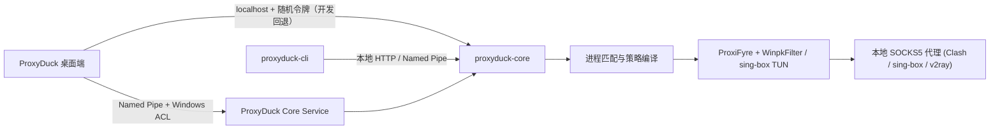

<div align="center">
  
  <h1>ProxyDuck</h1>
  <p><strong>面向进程的 Windows 应用流量分流与网络诊断工具</strong></p>
  <p>精准识别应用进程，将 TCP/UDP 流量重定向至指定的本地 SOCKS5 代理端口。</p>

  [简体中文](README.md) | [English](README.en.md)

  <br />

  [](https://github.com/rowanjove/ProxyDuck/releases)
  [](#系统要求)
  [](LICENSE)
  [](https://github.com/rowanjove/ProxyDuck/actions)
</div>

---

很多 Windows 应用程序不支持单独配置代理，或者强行走系统全局网络出口。ProxyDuck 提供底层的进程级网络路由能力：**精准识别指定进程，透明地将其 TCP 与 UDP 流量导流至对应的本地 SOCKS5 代理，无需修改目标应用，不影响整机其它流量。**

你可以让浏览器走一组节点，让 IDE 或 AI 编程工具走另一组独立线路，让游戏、会议软件或局域网工具保持直连。同时提供规则模拟器与 10 层网络链路急救体检，直观排查规则冲突与网络故障。

> 注：ProxyDuck 本身不提供任何节点服务，不替代 Clash、sing-box 或 v2ray。它专注于本机的“最后一公里”：将指定的应用进程流量，准确送达指定的本地代理出口。

## 界面概览

### 概览工作台
实时展示路由引擎状态、活动规则、已匹配进程与近期流量记录。


### 应用路由配置
支持按进程名、完整路径、PID（带创建时间防复用校验）或通配符分流；提供规则分组、标签、批量启停与预设模版。


### 网络急救 (Doctor)
提供 10 层网络与代理链路体检，自动诊断网卡、网关、DNS、Winsock、Hosts 与死代理端口，支持一键安全修复与配置快照回滚。


<sub>截图来自 ProxyDuck 1.1.0 隔离测试配置，所有代理端点均为本机回环地址，不含真实用户数据。</sub>

## 核心特性

| 能力 | 说明 |
| --- | --- |
| 🦆 **进程级精准分流** | 支持按进程名、完整路径、PID（绑定启动时间防复用）或通配符规则分流，无需设置全局系统代理 |
| 🌊 **多引擎数据平面** | 默认内置 ProxiFyre (WinpkFilter 驱动级数据包重定向)，支持按需启用 sing-box TUN 虚拟网卡后端 |
| 🩺 **网络急救 (Doctor)** | 10 层网络链路全景体检（网卡、网关、DNS、Winsock、Hosts、死代理端口），支持安全修复与秒级快照回滚 |
| 🧪 **策略工作台 (Studio)** | 规则策略模拟器，直观分析规则命中链与匹配优先级，排查失效规则与阴影遮蔽规则 (Shadowed Rules) |
| 🗂️ **配置方案 (Profiles V1)** | 方案快照管理，支持克隆、对比差异与一键无缝切换办公/开发/娱乐场景 |
| 📥 **端点安全导入** | 支持从 Clash `proxies` 和 sing-box `outbounds` 本地配置安全导入端点，带只读预览与类型校验 |
| 🛡️ **Windows Service** | 支持注册为 LocalSystem 后台服务，桌面端通过受限 ACL 的 Named Pipe 控制，兼顾权限最小化与无人值守 |
| 🔒 **本地凭据保护** | 代理密码采用 Windows DPAPI 加密隔离，配置文件导出与诊断包均提供自动脱敏保护 |
| 🧰 **桌面与 CLI 双控** | 日常使用开箱即用的 GUI 界面，同时提供功能对等的 `proxyduck-cli` 满足巡检与脚本自动化需求 |

## 一分钟上手

### 1. 下载安装

前往 [Releases](https://github.com/rowanjove/ProxyDuck/releases) 下载：

- `ProxyDuck-1.1.0-setup.exe`：安装版（推荐），安装时自动注册 Windows 服务与 WinpkFilter 驱动；日常桌面端以普通用户权限运行。
- `ProxyDuck-1.1.0-portable.zip`：便携版，解压即用；首次运行前需执行 `drivers\Install-WinpkFilter.cmd` 安装驱动。

> ProxyDuck 二进制包自带经过 SHA-256 校验的官方 ProxiFyre 与 WinpkFilter 驱动资产。未签名证书环境下，Windows SmartScreen 可能会弹出未知发布者提示，点击“仍要运行”即可。

### 2. 准备本地代理

让 Clash、sing-box、V2Ray 或其他代理程序开放一个本地 SOCKS5 端口，例如：

```text
127.0.0.1:7897
```

### 3. 添加端点与路由规则

在“代理端点”中添加本地 SOCKS5 地址并进行连通性测试，然后在“应用路由”中新建规则指定程序名与代理。

### 4. 开启路由

在“概览”页右上角打开路由开关。当状态显示“运行中”后，匹配规则的应用程序流量将自动被接管分流。

## 数据平面与引擎支持

| 组件 | 默认状态 | 版本 | 用途 |
| --- | --- | --- | --- |
| ProxiFyre | 已内置 | 2.4.0 x64 | 将指定进程的 TCP、UDP 流量转入 SOCKS5 |
| WinpkFilter | 已内置 | 3.6.2.1 x64 | ProxiFyre 使用的 Windows 数据包过滤驱动 |
| sing-box TUN | 用户安装 | 自动探测 | 可选的第二数据平面 |
| 原生 WFP | 规划中 | — | 需要独立内核签名驱动，列入后续规划 |

版本、下载地址与 SHA-256 校验哈希固定在 [`third_party/default-runtimes.json`](third_party/default-runtimes.json)。

第三方许可证见 [`THIRD_PARTY_NOTICES.md`](THIRD_PARTY_NOTICES.md)，源码版本见 [`THIRD_PARTY_SOURCES.md`](THIRD_PARTY_SOURCES.md)。

## 系统要求

- 操作系统：Windows 10 / 11 x64
- 权限说明：仅在安装 WinpkFilter 驱动与注册 Windows Service 时需要管理员权限；已安装服务的桌面端可使用标准普通用户权限运行
- 依赖项：本地可用的 SOCKS5 代理端点、WebView2 Runtime（Windows 11 已自带）

## 命令行操作 (CLI)

```powershell
# 查看整体状态
.\proxyduck-cli.exe status

# 开关路由
.\proxyduck-cli.exe runtime on
.\proxyduck-cli.exe runtime off

# 切换路由引擎
.\proxyduck-cli.exe mode set proxifyre

# 查看端点并导入本地配置（先预览，再提交）
.\proxyduck-cli.exe proxies list
.\proxyduck-cli.exe proxies import .\clash.json
.\proxyduck-cli.exe proxies import .\clash.json --apply

# 规则与配置方案管理
.\proxyduck-cli.exe rules list
.\proxyduck-cli.exe profiles list
.\proxyduck-cli.exe profiles create "开发环境"
.\proxyduck-cli.exe profiles diff <profile-id>

# 进程与日志查看
.\proxyduck-cli.exe processes list --filter code --limit 20
.\proxyduck-cli.exe logs --tail 50
```

服务已安装时 CLI 与桌面端自动通过 Named Pipe 通信；未安装服务时回退至 `http://127.0.0.1:46666`。

## 架构原理



## 从源码构建

环境要求：Rust stable、Node.js 20+、Visual Studio 2022 C++ Build Tools、Windows 10/11 x64。

```powershell
npm install
npx playwright install chromium

# 运行完整质量与一致性检查
.\scripts\verify-release.ps1

# 编译并生成 release 发行目录
.\scripts\build-release.ps1

# 打包便携版 zip 与发布清单
.\scripts\package-release.ps1
```

构建脚本会自动拉取并校验固定哈希的 ProxiFyre 与 WinpkFilter 官方发行包，缓存文件不会被提交至 Git。

## 本地数据与安全

未安装服务模式下数据存储于用户应用数据目录：

- `config.json5`：代理、规则、配置方案与设置
- `token`：本地 API 鉴权令牌，受当前用户 Windows DPAPI 保护
- `core.log`：核心启动与运行时日志
- `crash.log`：异常崩溃追踪

安装 Windows Service 后，配置自动安全迁移至 `%ProgramData%\ProxyDuck\config.json5`，由服务进程作为统一运行时真相，凭据转换为 machine scope 保护。

## 项目沿革

ProxyDuck 的前身是 **SmartFlow**。随着项目从简单的规则原型成长为包含桌面端、后台服务、CLI、驱动级数据平面与完整发布工程的软件，统一更名为 ProxyDuck。产品公开版本从 **1.0.0** 重新启程。

## 路线图与社区

- 版本路线图：[`ROADMAP.md`](ROADMAP.md)
- 参与贡献：[`CONTRIBUTING.md`](CONTRIBUTING.md)
- 安全报告：[`SECURITY.md`](SECURITY.md)
- 版本更新记录：[`CHANGELOG.md`](CHANGELOG.md)

欢迎提交 Issue 与 Pull Request 反馈问题或建议。提交 Bug 时请附带环境信息与诊断日志，便于快速排查定位。

## 开源许可

ProxyDuck 自有源码采用 [Apache-2.0 License](LICENSE)。第三方运行时保留各自许可证，MIT 许可不覆盖 ProxiFyre、WinpkFilter 或用户自行安装的代理内核。
