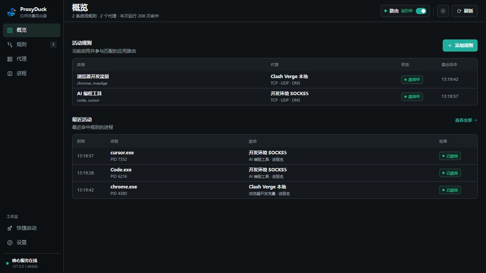
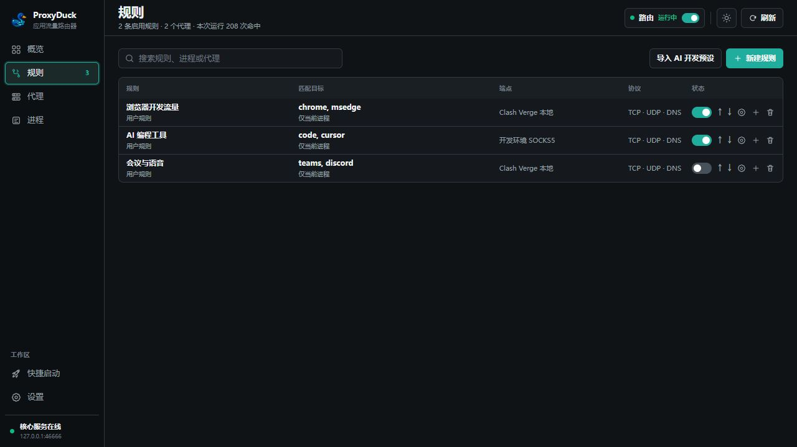
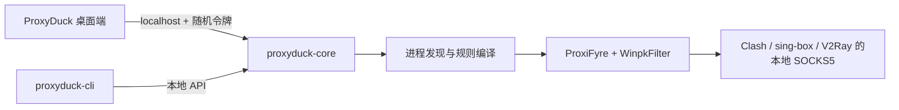

<div align="center">
  
  <h1>ProxyDuck</h1>
  <p><strong>让每一只应用，都游进它该去的网络水道。</strong></p>
  <p>一个轻巧、透明、面向进程的 Windows 应用流量路由器。</p>

  [](https://github.com/rowanjove/ProxyDuck/releases)
  [](#系统要求)
  [](LICENSE)
  [](https://github.com/rowanjove/ProxyDuck/actions)
</div>

---

有些程序懂代理，有些程序假装不懂，还有一些程序只愿意把流量交给系统默认出口。ProxyDuck 做的事情很简单：**认出正在运行的应用，再把它的 TCP、UDP 与 DNS 流量送往你指定的本地 SOCKS5 代理。**

你可以让浏览器走 Clash，让开发工具走另一条线路，让游戏、会议软件或下载器保持直连。规则只描述“谁应该去哪里”，启动、匹配、路由状态和最近命中则交给 ProxyDuck 统一呈现。

> ProxyDuck 不提供代理节点，也不会替代 Clash、sing-box 或 V2Ray。它负责的是最后一公里：把正确的应用，稳稳交给正确的本地代理入口。

## 看一眼，就知道流量去了哪里



概览页把路由开关、活动规则、数据平面状态和最近命中放在同一张工作台上。没有漂亮但含糊的“已连接”：核心、代理、规则和实际路由状态各自说真话。



规则按顺序确定优先级，可以按进程名、完整路径、PID 或通配符匹配；TCP、UDP 与 DNS 是否接管也能逐条表达。

<sub>截图来自 ProxyDuck 1.0.0 的隔离演示配置，所有代理地址均为本机回环地址，不包含真实用户数据。</sub>

## 它擅长什么

| 能力 | 说明 |
| --- | --- |
| 🦆 按应用分流 | 按进程名、完整路径、PID 或通配符匹配，不必把整台电脑交给同一条线路 |
| 🌊 TCP / UDP / DNS | 面向真实应用流量设计，覆盖浏览器、开发工具、语音和游戏等常见场景 |
| 🧭 确定性规则 | 规则顺序明确，支持冲突检查、复制、排序与进程试运行 |
| 🩺 如实诊断 | 核心、数据平面、代理连通性与防泄漏状态分别展示，错误不会被“在线”两个字掩盖 |
| 🔒 本地优先 | Core API 仅监听本机，并使用随机令牌鉴权；Windows 上令牌由当前用户 DPAPI 保护 |
| 🧰 桌面与 CLI | 日常操作使用桌面端，自动化、巡检和故障定位可以交给命令行工具 |
| 🌗 适合常驻 | 单实例、系统托盘、中英文界面、浅色/深色主题和紧凑桌面布局 |

## 一分钟上手

### 1. 下载

前往 [Releases](https://github.com/rowanjove/ProxyDuck/releases) 下载：

- `ProxyDuck-1.0.0-setup.exe`：推荐，安装时自动部署 WinpkFilter 驱动。
- `ProxyDuck-1.0.0-portable.zip`：免安装；首次使用前运行 `drivers\Install-WinpkFilter.cmd`。

> 当前 ProxyDuck 自身尚未配置商业代码签名证书，Windows SmartScreen 可能显示未知发布者提示。随包提供的 ProxiFyre 与 WinpkFilter 来自官方签名发布资产，并经过固定 SHA-256 校验。

### 2. 准备本地代理

先让 Clash、sing-box、V2Ray 或其他代理程序开放一个本地 SOCKS5 端口，例如：

```text
127.0.0.1:7897
```

### 3. 添加代理与规则

在“代理”中添加本地 SOCKS5 端点并执行连通性测试，然后在“规则”中选择应用和目标代理。

### 4. 打开路由

回到“概览”，打开右上角的路由开关。看到数据平面进入“运行中”后，最近活动会开始记录实际命中。

## 默认带了什么

官方 Windows x64 包坚持一个克制的选择：**开箱即用的只带一套主数据平面，其余引擎按需安装。**

| 组件 | 默认状态 | 版本 | 用途 |
| --- | --- | --- | --- |
| ProxiFyre | 已内置 | 2.4.0 x64 | 将指定进程的 TCP、UDP 流量转入 SOCKS5 |
| WinpkFilter | 已内置 | 3.6.2.1 x64 | ProxiFyre 使用的 Windows 数据包过滤驱动 |
| sing-box TUN | 用户安装 | 自动探测 | 可选的第二数据平面 |
| 原生 WFP | 尚未提供 | — | 需要独立签名驱动，列入后续路线图 |
| API Hook | 实验阶段 | — | 当前不会伪装成可用能力 |

版本、下载地址、文件大小与上游 SHA-256 固定在 [`third_party/default-runtimes.json`](third_party/default-runtimes.json)。构建脚本还会生成第二层 `RUNTIME-LOCK.json`，逐个校验发行包中的运行时文件。

第三方许可证见 [`THIRD_PARTY_NOTICES.md`](THIRD_PARTY_NOTICES.md)，精确源码版本见 [`THIRD_PARTY_SOURCES.md`](THIRD_PARTY_SOURCES.md)。

## 系统要求

- Windows 10 / 11 x64
- 管理员权限——安装驱动和接管应用流量时需要
- 一个可用的本地 SOCKS5 代理端点
- WebView2 Runtime（Windows 11 通常已内置）

## 命令行

```powershell
# 查看整体状态
.\proxyduck-cli.exe status

# 开关路由
.\proxyduck-cli.exe runtime on
.\proxyduck-cli.exe runtime off

# 切换到默认 ProxiFyre 数据平面
.\proxyduck-cli.exe mode set win-divert

# 查看代理、规则、进程与日志
.\proxyduck-cli.exe proxies list
.\proxyduck-cli.exe rules list
.\proxyduck-cli.exe processes list --filter code --limit 20
.\proxyduck-cli.exe logs --tail 50
```

CLI 默认连接 `http://127.0.0.1:46666`，也可以通过 `--core-url` 指定其他本地地址。

## 它是怎么工作的



- **桌面端**负责配置、状态、托盘和日常交互。
- **Core**负责进程发现、确定性匹配、运行时生命周期、防泄漏策略与本地 API。
- **数据平面**负责真正接管并转送目标应用的流量。
- **CLI**与桌面端共享同一套鉴权和配置语义，适合自动化与诊断。

## 从源码构建

需要 Rust stable、Node.js 20+、Visual Studio 2022 C++ Build Tools 与 Windows 10/11 x64。

```powershell
npm install
npx playwright install chromium

# 完整检查
.\scripts\verify-release.ps1

# 构建默认发行目录
.\scripts\build-release.ps1

# 生成 portable zip 与 SHA-256 清单
.\scripts\package-release.ps1
```

`build-release.ps1` 会下载并校验锁定版本的 ProxiFyre、WinpkFilter 与许可证文本；这些缓存文件不会提交到 Git。

sing-box 默认不下载。如需制作自定义捆绑包：

```powershell
.\scripts\build-release.ps1 `
  -BundleSingBox `
  -SingBoxPath "C:\path\to\sing-box.exe"
```

## 配置与数据

ProxyDuck 使用 Windows 应用数据目录保存：

- `config.json5`：代理、规则、快捷启动与运行设置
- `token`：本地 API 鉴权令牌，使用当前用户 DPAPI 加密
- `core.log`：核心启动和数据平面错误
- `crash.log`：本地崩溃记录与回溯

首次运行会自动迁移 ProxyDock 与更早的 SmartFlow 配置；旧目录不会被删除。

常用环境变量：

- `PROXYDUCK_CORE_URL`：Core API 地址
- `PROXYDUCK_PROXIFYRE_DIR`：自定义 ProxiFyre 目录
- `PROXYDUCK_SING_BOX_PATH`：用户安装的 `sing-box.exe` 路径
- `PROXYDUCK_ICON_DIR`：进程图标缓存目录

## 项目沿革

ProxyDuck 的前身是 **SmartFlow**。随着项目从简单的规则原型成长为包含桌面端、Core、CLI、真实数据平面与发布工程的完整软件，我们决定换一个更清楚、也更有记忆点的名字，从 **1.0.0** 重新出发。

旧 SmartFlow 仓库已经转为私有历史存档，不再接收更新；所有公开开发、Issue、Release 与路线图都将在本仓库继续。源码目录中仍保留部分 `smartflow-*` 物理文件夹，以避免无意义地破坏 Git 历史和外部脚本，产品标识与发布物均已使用 ProxyDuck。

## 路线图与参与开发

- 完整版本路线图：[`ROADMAP.md`](ROADMAP.md)
- 贡献代码、文档或测试：[`CONTRIBUTING.md`](CONTRIBUTING.md)
- 报告安全问题：[`SECURITY.md`](SECURITY.md)
- 版本变化：[`CHANGELOG.md`](CHANGELOG.md)

如果 ProxyDuck 恰好解决了你的麻烦，欢迎点一颗 Star；如果它还有哪里游得不够稳，欢迎带着复现步骤来开 Issue。一个好工具往往不是突然完成的，而是在真实使用里，一次次把模糊的问题变清楚。

## 开源许可

ProxyDuck 自有源码采用 [MIT License](LICENSE)。第三方运行时保留各自许可证，MIT 许可不覆盖 ProxiFyre、WinpkFilter 或用户自行安装的其他代理内核。
