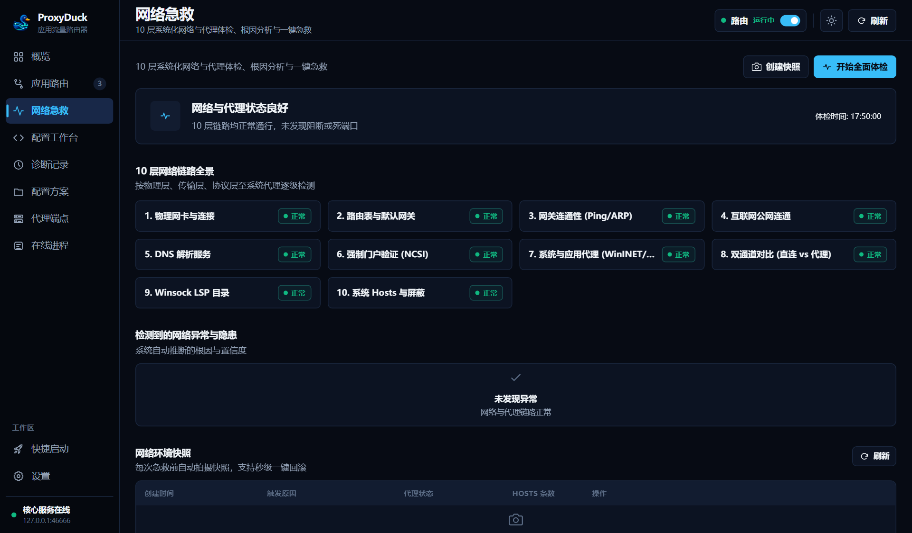
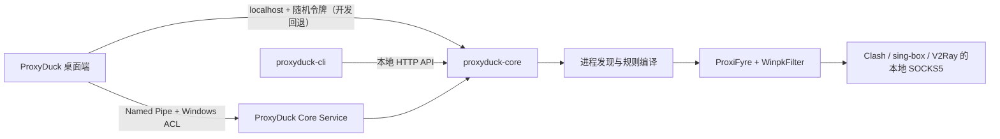

<div align="center">
  
  <h1>ProxyDuck</h1>
  <p><strong>面向进程的 Windows 应用流量分流与网络诊断工具</strong></p>
  <p>精准识别应用进程，将 TCP/UDP 流量重定向至指定的本地 SOCKS5 代理端口。</p>

  [](https://github.com/rowanjove/ProxyDuck/releases)
  [](#系统要求)
  [](LICENSE)
  [](https://github.com/rowanjove/ProxyDuck/actions)
</div>

---

很多 Windows 应用程序不支持单独配置代理，或者强行走系统全局网络出口。ProxyDuck 提供底层的进程级网络路由能力：**精准识别指定进程，透明地将其 TCP 与 UDP 流量导流至对应的本地 SOCKS5 代理，无需修改目标应用，不影响整机其它流量。**

你可以让浏览器走一组节点，让 IDE 或 AI 编程工具走另一组独立线路，让游戏、会议软件或局域网工具保持直连。同时提供规则模拟器与 10 层网络链路急救体检，直观排查规则冲突与网络故障。

> 注：ProxyDuck 本身不提供任何节点服务，不替代 Clash、sing-box 或 v2ray。它专注于本机的“最后一公里”：将指定的应用进程流量，准确送达指定的本地代理出口。

## 界面概览

### 概览工作台
实时展示路由引擎状态、活动规则、已匹配进程与近期流量记录。


### 应用路由配置
支持按进程名、完整路径、PID（带创建时间防复用校验）或通配符分流；提供规则分组、标签、批量启停与预设模版。


### 网络急救 (Doctor)
提供 10 层网络与代理链路体检，自动诊断网卡、网关、DNS、Winsock、Hosts 与死代理端口，支持一键安全修复与配置快照回滚。


<sub>截图来自 ProxyDuck 1.1.0 隔离测试配置，所有代理端点均为本机回环地址，不含真实用户数据。</sub>

## 它擅长什么

| 能力 | 说明 |
| --- | --- |
| 🦆 **进程级精准分流** | 支持按进程名、完整路径、PID（绑定启动时间防复用）或通配符规则分流，无需设置全局系统代理 |
| 🌊 **多引擎数据平面** | 默认内置 ProxiFyre (WinpkFilter 驱动级数据包重定向)，支持按需启用 sing-box TUN 虚拟网卡后端 |
| 🩺 **网络急救 (Doctor)** | 10 层网络链路全景体检（网卡、网关、DNS、Winsock、Hosts、死代理端口），支持安全修复与秒级快照回滚 |
| 🧪 **策略工作台 (Studio)** | 规则策略模拟器，直观分析规则命中链与匹配优先级，排查失效规则与阴影遮蔽规则 (Shadowed Rules) |
| 🗂️ **配置方案 (Profiles V1)** | 方案快照管理，支持克隆、对比差异与一键无缝切换办公/开发/娱乐场景 |
| 📥 **端点安全导入** | 支持从 Clash `proxies` 和 sing-box `outbounds` 本地配置安全导入端点，带只读预览与类型校验 |
| 🛡️ **Windows Service** | 支持注册为 LocalSystem 后台服务，桌面端通过受限 ACL 的 Named Pipe 控制，兼顾权限最小化与无人值守 |
| 🔒 **本地凭据保护** | 代理密码采用 Windows DPAPI 加密隔离，配置文件导出与诊断包均提供自动脱敏保护 |
| 🧰 **桌面与 CLI 双控** | 日常使用开箱即用的 GUI 界面，同时提供功能对等的 `proxyduck-cli` 满足巡检与脚本自动化需求 |

## 一分钟上手

### 1. 下载安装

前往 [Releases](https://github.com/rowanjove/ProxyDuck/releases) 下载：

- `ProxyDuck-1.1.0-setup.exe`：安装版（推荐），安装时自动注册 Windows 服务与 WinpkFilter 驱动；日常桌面端以普通用户权限运行。
- `ProxyDuck-1.1.0-portable.zip`：便携版，解压即用；首次运行前需执行 `drivers\Install-WinpkFilter.cmd` 安装驱动。

> ProxyDuck 二进制包自带经过 SHA-256 校验的官方 ProxiFyre 与 WinpkFilter 驱动资产。未签名证书环境下，Windows SmartScreen 可能会弹出未知发布者提示，点击“仍要运行”即可。

### 2. 准备本地代理

先让 Clash、sing-box、V2Ray 或其他代理程序开放一个本地 SOCKS5 端口，例如：

```text
127.0.0.1:7897
```

### 3. 添加代理与规则

在“代理”中添加本地 SOCKS5 端点并执行连通性测试，然后在“规则”中选择应用和目标代理。

### 4. 打开路由

回到“概览”，打开右上角的路由开关。看到数据平面进入“运行中”后，最近活动会开始记录进程匹配；这不是连接数、字节数或 DNS 查询统计。

## 默认带了什么

官方 Windows x64 包坚持一个克制的选择：**开箱即用的只带一套主数据平面，其余引擎按需安装。**

| 组件 | 默认状态 | 版本 | 用途 |
| --- | --- | --- | --- |
| ProxiFyre | 已内置 | 2.4.0 x64 | 将指定进程的 TCP、UDP 流量转入 SOCKS5 |
| WinpkFilter | 已内置 | 3.6.2.1 x64 | ProxiFyre 使用的 Windows 数据包过滤驱动 |
| sing-box TUN | 用户安装 | 自动探测 | 可选的第二数据平面 |
| 原生 WFP | 尚未提供 | — | 需要独立签名驱动，列入后续路线图 |
| API Hook | 实验阶段 | — | 当前不会伪装成可用能力 |

版本、下载地址、文件大小与上游 SHA-256 固定在 [`third_party/default-runtimes.json`](third_party/default-runtimes.json)。构建脚本还会生成第二层 `RUNTIME-LOCK.json`，逐个校验发行包中的运行时文件。

第三方许可证见 [`THIRD_PARTY_NOTICES.md`](THIRD_PARTY_NOTICES.md)，精确源码版本见 [`THIRD_PARTY_SOURCES.md`](THIRD_PARTY_SOURCES.md)。

## 系统要求

- Windows 10 / 11 x64
- 管理员权限——仅安装驱动和注册 Windows Service 时需要；日常已安装服务的桌面控制端可使用标准用户权限
- 一个可用的本地 SOCKS5 代理端点
- WebView2 Runtime（Windows 11 通常已内置）

## 命令行

```powershell
# 查看整体状态
.\proxyduck-cli.exe status

# 开关路由
.\proxyduck-cli.exe runtime on
.\proxyduck-cli.exe runtime off

# 切换到默认 ProxiFyre 数据平面
.\proxyduck-cli.exe mode set proxifyre

# 旧版命令仍可兼容
.\proxyduck-cli.exe mode set win-divert

# 查看代理、规则、进程与日志
.\proxyduck-cli.exe proxies list
# 先预览 Clash/sing-box 本地端点，再显式提交合并
.\proxyduck-cli.exe proxies import .\clash.json
.\proxyduck-cli.exe proxies import .\clash.json --apply
.\proxyduck-cli.exe rules list
.\proxyduck-cli.exe profiles list
.\proxyduck-cli.exe profiles create "开发环境"
.\proxyduck-cli.exe profiles diff <profile-id>
.\proxyduck-cli.exe processes list --filter code --limit 20
.\proxyduck-cli.exe logs --tail 50
```

服务已安装时 CLI 与桌面端一样自动走 Named Pipe；未安装服务时默认连接 `http://127.0.0.1:46666`，也可以通过 `--core-url` 指定其他本地地址。

## 它是怎么工作的



- **桌面端**负责配置、状态、托盘和日常交互；检测到已安装服务时通过 Named Pipe 调用 Core。
- **Windows Service**负责无人值守的 Core、引擎和健康检查生命周期；Named Pipe 按安装用户 SID、Administrators 和 SYSTEM 限制访问。
- **Core**负责进程发现、确定性匹配、运行时生命周期、防泄漏策略与本地 API。
- **数据平面**负责真正接管并转送目标应用的流量。
- **CLI**与桌面端共享同一套鉴权和配置语义，适合自动化与诊断。

## 从源码构建

需要 Rust stable、Node.js 20+、Visual Studio 2022 C++ Build Tools 与 Windows 10/11 x64。

```powershell
npm install
npx playwright install chromium

# 完整检查
.\scripts\verify-release.ps1

# 构建默认发行目录
.\scripts\build-release.ps1

# 生成 portable zip、发布 manifest 与 SHA-256 清单
.\scripts\package-release.ps1

# 只有本轮 ISCC 已生成 installer proof 时，才同时打包安装器
.\scripts\package-release.ps1 -RequireInstaller
```

打包会生成 `release/release-manifest.json`，记录 buildId、源码提交、运行时锁哈希、载荷哈希和签名状态；它与 `SHA256SUMS.txt` 一起作为后续更新器或发布审计的输入。

本地构建默认允许未签名，便于开发和测试；正式 Release workflow 会强制要求
`PROXYDUCK_SIGNING_PFX_BASE64` 与 `PROXYDUCK_SIGNING_PFX_PASSWORD`，并在签名后验证
所有 EXE 的 Authenticode 状态。若要在受控构建机上复现该门禁，可运行：

```powershell
.\scripts\sign-release.ps1 -Directory .\release\ProxyDuck -RequireSignature
.\scripts\sign-release.ps1 -Directory .\release\installer -RequireSignature
.\scripts\package-release.ps1 -RequireInstaller -RequireSignature
# 正式发布还应在干净 checkout 上增加：-RequireCleanSource
```

`build-release.ps1` 会下载并校验锁定版本的 ProxiFyre、WinpkFilter 与许可证文本；这些缓存文件不会提交到 Git。

sing-box 默认不下载。如需制作自定义捆绑包：

```powershell
.\scripts\build-release.ps1 `
  -BundleSingBox `
  -SingBoxPath "C:\path\to\sing-box.exe"
```

## 配置与数据

未安装服务的开发/portable 模式使用当前用户应用数据目录保存：

- `config.json5`：代理、规则、快捷启动与运行设置
- `token`：本地 API 鉴权令牌，使用当前用户 DPAPI 加密
- `core.log`：核心启动和数据平面错误
- `crash.log`：本地崩溃记录与回溯

首次运行会自动迁移 ProxyDock 与更早的 SmartFlow 配置；旧目录不会被删除。

安装服务时会把配置迁移到 `%ProgramData%\ProxyDuck\config.json5`，由服务作为运行时真相；安装过程在原用户会话中把已有 Current User DPAPI 凭据重加密到 `%ProgramData%\ProxyDuck\secrets` 的 machine scope。任何凭据无法迁移都会阻止服务安装，不会静默丢失认证。

常用环境变量：

- `PROXYDUCK_CORE_URL`：Core API 地址
- `PROXYDUCK_PROXIFYRE_DIR`：自定义 ProxiFyre 目录
- `PROXYDUCK_SING_BOX_PATH`：用户安装的 `sing-box.exe` 路径
- `PROXYDUCK_ICON_DIR`：进程图标缓存目录

发布清单可用以下命令离线复核；它会重新计算 portable、installer、各 EXE 和运行时锁的哈希：

```powershell
.\scripts\verify-release-manifest.ps1
```

## 项目沿革

ProxyDuck 的前身是 **SmartFlow**。随着项目从简单的规则原型成长为包含桌面端、Core、CLI、真实数据平面与发布工程的完整软件，我们决定换一个更清楚、也更有记忆点的名字，从 **1.0.0** 重新出发。

旧 SmartFlow 仓库已经转为私有历史存档，不再接收更新；所有公开开发、Issue、Release 与路线图都将在本仓库继续。源码目录中仍保留部分 `smartflow-*` 物理文件夹，以避免无意义地破坏 Git 历史和外部脚本，产品标识与发布物均已使用 ProxyDuck。

## 路线图与参与开发

- 完整版本路线图：[`ROADMAP.md`](ROADMAP.md)
- 贡献代码、文档或测试：[`CONTRIBUTING.md`](CONTRIBUTING.md)
- 报告安全问题：[`SECURITY.md`](SECURITY.md)
- 版本更新记录：[`CHANGELOG.md`](CHANGELOG.md)

欢迎提交 Issue 与 Pull Request 反馈问题或建议。提交 Bug 时请附带环境信息与诊断日志，便于快速排查定位。

## 开源许可

ProxyDuck 自有源码采用 [MIT License](LICENSE)。第三方运行时保留各自许可证，MIT 许可不覆盖 ProxiFyre、WinpkFilter 或用户自行安装的其他代理内核。
